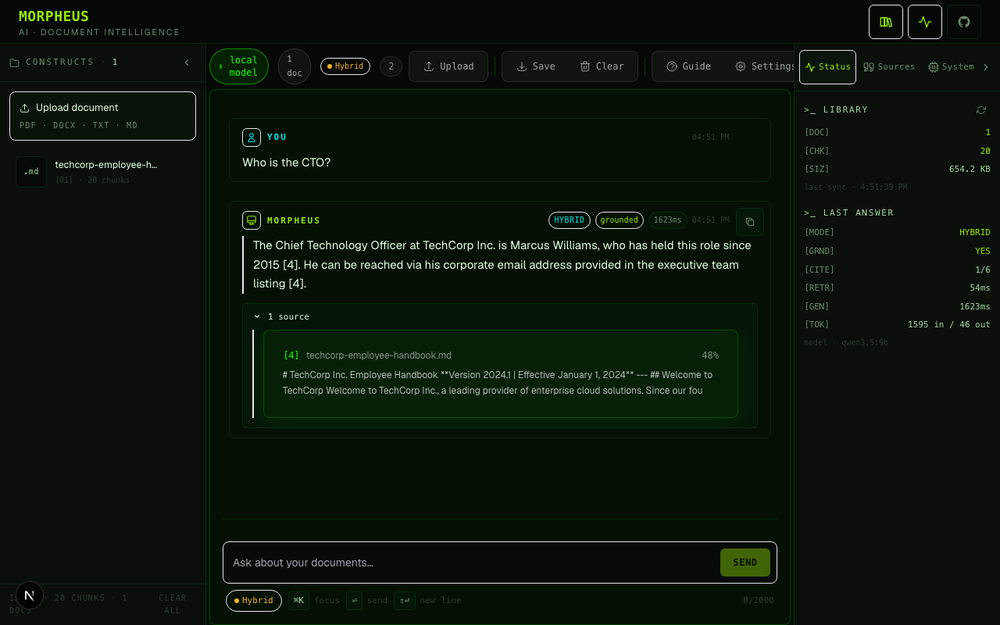

# Morpheus

Ask questions about your own documents and get answers where every claim points at a real passage. Runs entirely on your machine: Ollama for the models, LanceDB for the index, nothing sent anywhere.



## What it does

- **Upload** PDF, DOCX, TXT or Markdown. Each file is chunked, embedded with `nomic-embed-text` and indexed on disk.
- **Ask** in plain English. Retrieval is hybrid (vector search plus BM25 keyword search, fused) and a local model answers with `[n]` markers pointing at the passages it used. The default model is `qwen3.5:9b`; any chat model installed in Ollama can be picked in Settings.
- **Trust the markers.** Every `[n]` is checked, while the answer streams, against the passages retrieved for that question. A marker the model made up never reaches the screen. If the documents do not contain the answer, Morpheus says exactly that instead of guessing, and any answer that cites nothing is flagged "not grounded".
- **Deep mode** asks the model for up to three sub-questions, searches each, and fuses the results before answering.

## What leaves your machine

At inference time, nothing. Upload, indexing, retrieval and generation talk only to `127.0.0.1`: the backend on port 8000 and Ollama on port 11434. Documents, embeddings and the search index live in `backend/data/` and stay there until you delete them, and deleting a document removes its bytes from disk, not just from search results.

That is a claim, so it comes with the tests that would fail if it stopped being true:

- `backend/tests/test_no_egress.py` runs the whole upload-and-answer flow with the socket layer patched to refuse anything that is not loopback.
- `backend/scripts/prove_local.sh` runs the backend under a macOS kernel sandbox that denies all non-loopback network, drives a real ingest-and-query cycle against Ollama, and samples `lsof` throughout. Its output is recorded in `SECURITY_REVIEW.md`.
- CI runs the backend suite inside a Linux network namespace that has only the loopback interface, and a Playwright test fails if the browser makes a request to any host but localhost.
- A static test fails if a cloud SDK, a telemetry client or a non-loopback URL ever appears in the backend.

Network activity does happen at install time and nowhere else: `ollama pull` for the two models, `pip` and `npm` for dependencies. The Ollama desktop app checks for updates on its own; run `ollama serve` from a terminal if you want none of that.

Documents are treated as data, never as instructions. A document that tells the model to ignore its rules gets quoted, not obeyed, and the citation check makes any steering visible. That is mitigation, not immunity; no system with a language model in it can promise the latter.

## Run it

You need Ollama, Python 3.11 or newer, and Node 20 or newer. No accounts, no API keys, no `.env` file.

```bash
ollama pull nomic-embed-text      # 274 MB, embeddings
ollama pull qwen3.5:9b            # 6.6 GB, answers

cd backend
python3 -m venv .venv && .venv/bin/pip install -r requirements.txt
.venv/bin/uvicorn app.main:app    # http://127.0.0.1:8000

cd ../frontend
npm install && npm run dev        # http://localhost:3000
```

Or, with Ollama running on the host, `docker compose up` brings up both services with their ports published on `127.0.0.1` only. `DEPLOYMENT.md` has the details, the configuration table, and a warning about what exposing the app beyond your own machine would mean.

## Honest limits

- A 9B model is not a hosted frontier model. Answers are shorter and plainer, and the citation check exists partly because a small model sometimes skips a marker; that shows up as "not grounded" rather than as a silently wrong answer. `qwen3.5:27b` is the quality option if you have the memory.
- `nomic-embed-text` is English-focused. `bge-m3` is the multilingual alternative; switching embedding models means re-indexing, and the store refuses to mix them.
- The first answer after a restart loads the model into memory, which takes a few seconds; every answer after that is quick.
- One user at a time. It is a tool on your machine, not a service.
- Scanned-image PDFs have no text to extract; there is no OCR.

## Verify it yourself

```bash
cd backend
.venv/bin/pytest                  # 100+ tests, offline
scripts/prove_local.sh            # macOS: kernel sandbox + lsof sampling, needs Ollama running
```

Or turn Wi-Fi off, upload `backend/test-documents/techcorp-employee-handbook.md`, ask the questions in `backend/test-documents/DEMO-QUERIES.md`, and ask one it cannot answer.

## Security

The full review is in `SECURITY_REVIEW.md` (28 findings against the previous cloud-backed version, each tracked to the commit that resolved it), the trust boundary in `THREAT_MODEL.md`, and the audit that drove the rebuild in `docs/audit/`.

## Built with

Next.js 15, TypeScript and Tailwind on the front; FastAPI, LanceDB, pypdf and python-docx on the back; Ollama for the models.

## Licence

MIT, see [LICENSE](LICENSE).
